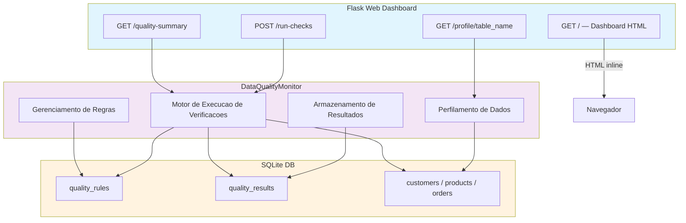
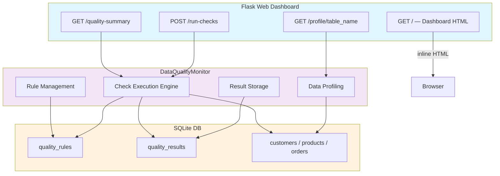

# Data-Quality-Monitor

[](https://www.python.org/)
[](https://flask.palletsprojects.com/)
[](https://pandas.pydata.org/)
[](LICENSE)

[Portugues](#portugues) | [English](#english)

---

## Portugues

### Descricao

Monitor de qualidade de dados com regras de validacao configuraveis, dashboard web Flask e relatorios de qualidade para tabelas SQLite.

### Funcionalidades

- **Verificacao de nulos**: Detecta e reporta percentual de valores nulos por coluna
- **Validacao de formato**: Valida dados contra expressoes regulares configuraveis (e-mail, telefone, etc.)
- **Verificacao de intervalo**: Checa se valores numericos estao dentro de limites definidos
- **Verificacao de unicidade**: Identifica duplicatas em colunas que devem ser unicas
- **Integridade referencial**: Verifica chaves estrangeiras entre tabelas
- **Perfilamento de dados**: Gera estatisticas descritivas por coluna (contagem, nulos, unicos, min, max, media, desvio padrao)
- **Dashboard web**: Interface HTML inline servida pelo Flask com visualizacao de metricas, tendencias (Chart.js) e resultados
- **Armazenamento de resultados**: Historico de verificacoes salvo em SQLite para analise de tendencias

### O que este projeto NAO possui

- Processamento paralelo
- Configuracao via YAML/JSON externo
- Pipeline ETL
- Cache
- Middleware pipeline
- Camada de documentacao de API
- Containerizacao
- CI/CD funcional
- Testes completos (apenas scaffold)

### Arquitetura



### Stack Tecnologica

| Tecnologia | Descricao | Papel |
|------------|-----------|-------|
| **Python** | Linguagem principal | Core |
| **Flask** | Framework web leve | Servidor e rotas |
| **pandas** | Manipulacao de dados | Consultas e agregacoes |
| **SQLite** | Banco de dados embutido | Armazenamento |

### Inicio Rapido

```bash
# Clonar o repositorio
git clone https://github.com/galafis/Data-Quality-Monitor.git
cd Data-Quality-Monitor

# Criar e ativar ambiente virtual
python -m venv venv
source venv/bin/activate  # Windows: venv\Scripts\activate

# Instalar dependencias
pip install -r requirements.txt

# Executar a aplicacao
python quality_monitor.py
```

Acesse `http://localhost:5000` no navegador para visualizar o dashboard.

O dashboard HTML e servido inline (sem arquivos de template separados). Ele inclui tres abas: Dashboard (metricas e tendencias), Verificacoes de Qualidade (executar e visualizar resultados) e Perfilamento de Dados (estatisticas por tabela).

### Testes

O diretorio `tests/` contem apenas um scaffold basico. Testes unitarios completos ainda nao foram implementados.

```bash
pytest tests/ -v
```

### Estrutura do Projeto

```
Data-Quality-Monitor/
├── quality_monitor.py   # Aplicacao principal (classe + Flask + HTML)
├── requirements.txt     # Dependencias Python
├── tests/               # Scaffold de testes
│   ├── __init__.py
│   └── test_main.py
├── LICENSE
└── README.md
```

### Autor

**Gabriel Demetrios Lafis**
- GitHub: [@galafis](https://github.com/galafis)
- LinkedIn: [Gabriel Demetrios Lafis](https://linkedin.com/in/gabriel-demetrios-lafis)

### Licenca

Este projeto esta licenciado sob a Licenca MIT — veja o arquivo [LICENSE](LICENSE) para detalhes.

---

## English

### Description

Data quality monitor with configurable validation rules, Flask web dashboard, and quality reports for SQLite tables.

### Features

- **Null checks**: Detects and reports null value percentage per column
- **Format validation**: Validates data against configurable regular expressions (email, phone, etc.)
- **Range checks**: Verifies numeric values fall within defined bounds
- **Uniqueness checks**: Identifies duplicates in columns that should be unique
- **Foreign key integrity**: Validates referential integrity between tables
- **Data profiling**: Generates descriptive statistics per column (count, nulls, uniques, min, max, mean, std dev)
- **Web dashboard**: Inline HTML interface served by Flask with metrics visualization, trends (Chart.js), and results
- **Result storage**: Check history saved in SQLite for trend analysis

### What this project does NOT have

- Parallel processing
- External YAML/JSON configuration
- ETL pipeline
- Cache
- Middleware pipeline
- API documentation layer
- Containerization
- Functional CI/CD
- Complete tests (scaffold only)

### Architecture



### Tech Stack

| Technology | Description | Role |
|------------|-------------|------|
| **Python** | Core language | Core |
| **Flask** | Lightweight web framework | Server and routing |
| **pandas** | Data manipulation | Queries and aggregation |
| **SQLite** | Embedded database | Storage |

### Quick Start

```bash
# Clone the repository
git clone https://github.com/galafis/Data-Quality-Monitor.git
cd Data-Quality-Monitor

# Create and activate virtual environment
python -m venv venv
source venv/bin/activate  # Windows: venv\Scripts\activate

# Install dependencies
pip install -r requirements.txt

# Run the application
python quality_monitor.py
```

Open `http://localhost:5000` in your browser to view the dashboard.

The HTML dashboard is served inline (no separate template files). It includes three tabs: Dashboard (metrics and trends), Quality Checks (run and view results), and Data Profiling (per-table statistics).

### Tests

The `tests/` directory contains only a basic scaffold. Full unit tests have not been implemented yet.

```bash
pytest tests/ -v
```

### Project Structure

```
Data-Quality-Monitor/
├── quality_monitor.py   # Main application (class + Flask + HTML)
├── requirements.txt     # Python dependencies
├── tests/               # Test scaffold
│   ├── __init__.py
│   └── test_main.py
├── LICENSE
└── README.md
```

### Author

**Gabriel Demetrios Lafis**
- GitHub: [@galafis](https://github.com/galafis)
- LinkedIn: [Gabriel Demetrios Lafis](https://linkedin.com/in/gabriel-demetrios-lafis)

### License

This project is licensed under the MIT License — see the [LICENSE](LICENSE) file for details.
